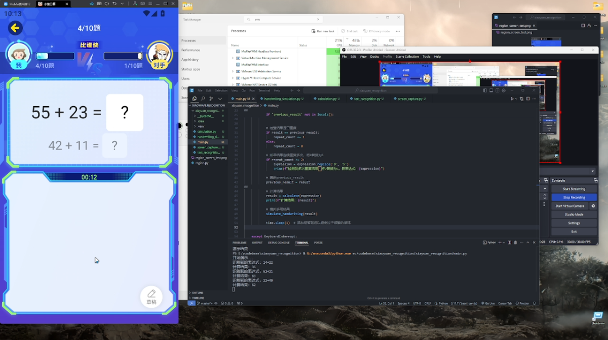

# Xiaoyuan Recognition Project 🐒

## 🐵 Project Introduction
This Python project utilizes Tesseract OCR technology to automatically recognize arithmetic problems (addition and subtraction) from the "Xiaoyuan Kousuan" app. It can currently handle arithmetic problems for up to third grade difficulty, including two-digit and three-digit addition and subtraction, making it an efficient tool for solving problems.

Suggestions for improvements are welcome from the community.

## 🚀 Key Features

- **Screen Capture**: Uses `pyautogui` to precisely capture screenshots of a designated area on the screen.
- **Text Recognition**: Employs the powerful OCR capability of `pytesseract` to recognize arithmetic expressions in screenshots.
- **Smart Calculation**: Parses recognized expressions and performs accurate calculations.
- **Handwriting Simulation**: Leverages `pyautogui` to realistically simulate handwritten results of the calculations.

Note: The project is based on an Android emulator for screen capturing. Position parameters in the code may vary by user.

## 🖥️ Demo

For the complete process, please refer to the demo.mkv file.

## 🚨 Disclaimer
This project is still in its early testing phase, and more features may be added in the future.
It is currently for educational and research purposes only. Please do not use it for any illegal activities. Additionally, I do not recommend activities like “fishing” (cheating in educational apps).
